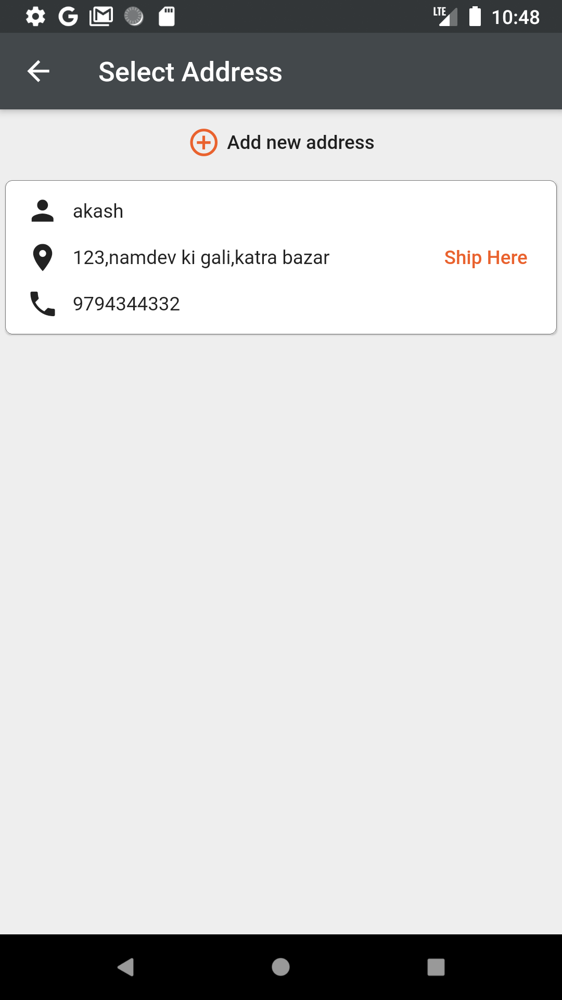

# Online Grocery Store
<text>I made a grocery app which gives users a rich and elegant experience of

buying groceries. In this app ,customers can search and order groceries

from very various categories and check real time order status. I created

this app using the flutter framework .I used firebase firestore database for

storing the product's details and other information, firebase storage for

storing images, and firebase authentication for authenticating users. I

also created an admin app in which admin can control prices, name of

categories and products,stocks of products, coupons etc. in real time.

<text>
   

